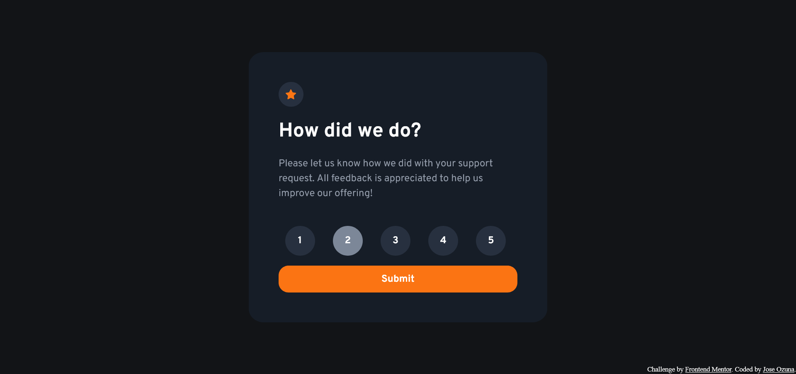

# Frontend Mentor - Interactive rating component solution

This is a solution to the [Interactive rating component challenge on Frontend Mentor](https://www.frontendmentor.io/challenges/interactive-rating-component-koxpeBUmI). Frontend Mentor challenges help you improve your coding skills by building realistic projects. 

## Table of contents

- [Overview](#overview)
  - [The challenge](#the-challenge)
  - [Screenshot](#screenshot)
  - [Links](#links)
- [My process](#my-process)
  - [Built with](#built-with)
  - [What I learned](#what-i-learned)
- [Author](#author)

## Overview

### The challenge

Users should be able to:

- View the optimal layout for the app depending on their device's screen size
- See hover states for all interactive elements on the page
- Select and submit a number rating
- See the "Thank you" card state after submitting a rating

### Screenshot

### Links

- Solution URL: [Add solution URL here](https://your-solution-url.com)
- Live Site URL: [Add live site URL here](https://joseozuna48.github.io/interactive-rating/com)

## My process

### Built with

- Semantic HTML5 markup
- CSS custom properties
- Flexbox
- CSS Grid
- Mobile-first workflow
- css Variables

### What I learned

For this project what I wanted to learn was how to use css variables. By adding variables in css we are able to use the same value
multiple times in the page, so in case we want to make a change on the styling of some element on the page with the help of variables
we only need to change a single value instead of looking in the whole document instances of that value and replacing them one by one.
Also something new I learned with this project is that use of the DOM, to get a value from a form and be able to display it on another 
page.

## Author

- Website - [Jose Ozuna](https://github.com/joseozuna48)
- Frontend Mentor - [@joseozuna48](https://www.frontendmentor.io/profile/joseozuna48)